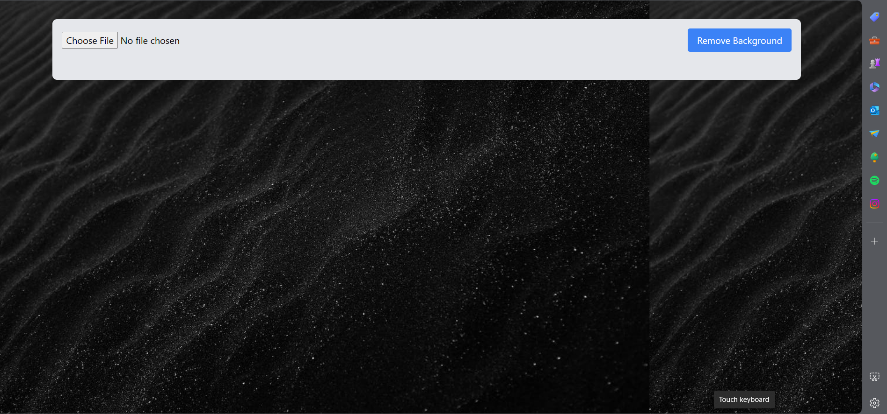
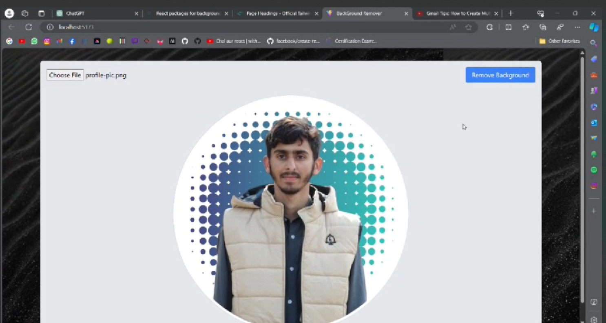
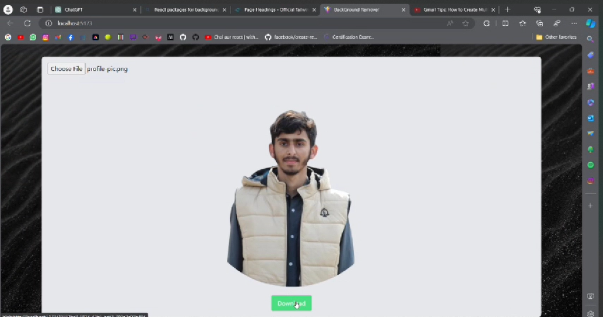

# Background Remover Site using React JS



Say goodbye to background headaches! 🚀 Our Background Remover Site, crafted with React.js, makes it a breeze to cut out backgrounds from your photos. It's quick, fun, and hassle-free. Give your images a fresh look – try it now! 🎉 #ReactJS #BackgroundRemover


## Tech Stack

* React: The app's dynamic and responsive user interface is developed using React, ensuring a seamless and interactive user experience.
* Tailwind CSS: Tailwind CSS is employed to style the application, resulting in an elegant and visually appealing design that aligns with modern web development standards.


## To Get Api Key

* Visit [Bg_Remove](https://www.remove.bg/api)
* Create a account
* Make a free API

### Note
Free API only valid for 1 month
## Environment Variables

To run this project, you will need to add the following environment variables to your .env file

`REACT_APP_API_BG` = `Your api key`


## Run Locally

Clone the project

```bash
  git clone https://github.com/Abdulmehad/BackgroundRemover
```

Go to the project directory

```bash
  cd my-project
```
Change `YOUR_API_KEY` with the API key of your own in the `./customhook/useBgRemoval` file

```bash
  'X-Api-Key'='YOUR_API_KEY'
```

Install dependencies

```bash
  npm install
```

Start the server

```bash
  npm run start
```
## Usage
Once you have the Background Remover app up and running, follow these steps to remove backgrounds from your photos:

* Upload an image by clicking the "Upload Image" button.
* Use the available tools and options to refine the selection and make any necessary adjustments.
* Click the "Remove Background" button to initiate the background removal process.
* Wait for the app to process the image and remove the background.
* Once the background removal is complete, you can download the edited image with the transparent background.
## Overview

[Click here](https://github.com/Abdulmehad/BackgroundRemover/blob/master/tutorial.mp4) to watch a video tutorial that will guide you on how to use.

## Demo
```bash
1- File is uploaded
```

```bash
2- After clicking  `Remove Background Button`
```

```bash
3-Hit Downlod Button to download the file
```

### Repo Activity


